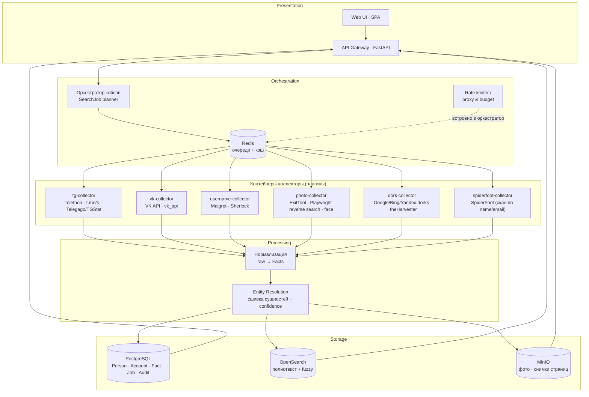

# Архитектура системы «OSINT Person Search»

Статус: проект (Этап 0) · Автор: совместно с ассистентом · Обновлено: 2026-09-29

---

## 1. Цели и принципы

**Цель.** Платформа, которая по любому из входных идентификаторов человека собирает публично доступную информацию из внешних источников, нормализует её, связывает факты с единой сущностью «Человек» и выдаёт исследователю досье с указанием источника и достоверности каждого факта.

**Принципы:**

1. **Только открытые источники** — без обхода авторизации, CAPTCHA, платных стен; пассивные методы по умолчанию.
2. **Коллекторы = плагины** — каждый внешний инструмент инкапсулирован за единым интерфейсом, добавление нового источника не трогает ядро.
3. **Всё в контейнерах** — `docker compose up` поднимает всю систему; ни один инструмент не требует ручной установки на хост.
4. **Доказательность** — каждый факт хранится со ссылкой-источником (URL), снимком и таймстампом: результат воспроизводим.
5. **Аудируемость и ограничения** — rate limit, бюджет запросов на кейс, журнал запросов.

---

## 2. Входные сценарии

| # | Вход | Типичные подсказки | Что ожидаем получить |
|---|------|--------------------|----------------------|
| S1 | Telegram: `@nick`, `t.me/имя` | — | Имя, био, фото, ID, общие группы, публичные посты, те же ники на других площадках |
| S2 | VK: ссылка/ID/nick | — | Город, дата рождения, университет, школа, друзья, группы, стена, фото, гео-метки |
| S3 | Фотография | ФИО (опц.) | EXIF (устройство, дата, GPS), совпадения в интернете (reverse image), лицо → другие фото, дубликаты |
| S4 | ФИО + возраст + город + университет | плюс любые ники/email | Кандидаты-профили с проверкой соответствия подсказкам (скоринг), email-ы, дorks-результаты |

Сценарии **не изолированы**: результат любого из них питает остальные (найденный в VK ник → вход для S1/S3; фото из VK → вход для S3 и т.д.). Это и есть цикл расследования.

---

## 3. Варианты архитектуры

### Вариант A — «Оркестратор-хаб» ✅ рекомендуется для MVP

Единое ядро (FastAPI + очередь задач Redis + Celery/Arq), коллекторы — отдельные Python-пакеты/образы, подключаемые к очереди. Хранилища: PostgreSQL + OpenSearch + MinIO.

```
[UI/API] → [Оркестратор] → очередь → [worker-контейнеры-коллекторы]
                      ↓                         ↓
                [Postgres/OS/MinIO] ← [нормализация + связывание]
```

- ✅ Быстро построить, просто деплоить одним `compose`, общий код нормализации, единый контракт плагина.
- ✅ Коллекторы по-прежнему изолированы (отдельные контейнеры = свои зависимости/версии).
- ⚠️ Нужен дисциплинированный контракт данных между воркерами и ядром.

### Вариант B — «Микросервис на каждый инструмент»

Каждый инструмент (maigret, vk-collector, tg-collector, photo-search, spiderfoot) — самостоятельный сервис со своим HTTP API и очередью, связанный шиной событий (NATS/Kafka).

- ✅ Максимальная изоляция и горизонтальное масштабирование, разные рантаймы.
- ❌ Значительный операционный overhead на старте; дублирование обвязки (логи, ретраи, секреты, контракты) в каждом сервисе.
- **Вердикт**: избыточно для MVP, но дизайн контрактов из Variant A не мешает позже «разнести» коллекторы в отдельные сервисы.

### Вариант C — «Готовое ядро + обёртка»

Взять существующий all-in-one фреймворк (SpiderFoot или Maltego) как движок сбора, а свою платформу построить как оболочку: нормализация, связывание сущностей, кейсы, отчёты.

- ✅ 200+ модулей сбора «из коробки».
- ❌ Данные SpiderFoot слабо ложатся на модель «человек ↔ аккаунты»; ограниченная кастомизация, тяжёлые зависимости, вероятны конфликты лицензий/авторских прав при форкировании; Maltego CE — закрытая лицензия и не про Docker.
- **Вердикт**: использовать SpiderFoot **как один из коллекторов** (Variant A), но не как ядро.

### Вариант D — «CLI-first пайплайны» (компромиссный старт)

Сначала — CLI + YAML-файлы конвейеров (`person.yaml → maigret, vk, dorks → отчёт.html`), без веб-интерфейса и очередей; затем на выросшем ядре появляется API/UI.

- ✅ Минимум инфраструктуры, итерации по содержимому поиска быстрые.
- ❌ Нет интерактивности, сложно делиться кейсами.
- **Вердикт**: **сочетаем с Variant A** — первые конвейеры отрабатывают как CLI-джобы внутри общего контракта, UI добавляется вторым этапом.

> **Рекомендация: Variant A + CLI-first.** Ядро-оркестратор сразу с плагин-контрактом; каждый коллектор — Docker-образ; UI — после стабилизации конвейеров. Путь к Variant B открыт (контракты уже сервисные).

---

## 4. Целевая архитектура (Variant A)



### 4.1 Компоненты

| Компонент | Реализация | Ответственность |
|---|---|---|
| **API Gateway** | FastAPI (uvicorn) | REST: создание кейса, запуск/статус джоб, получение досье, экспорт (JSON/HTML/PDF) |
| **Оркестратор** | Celery (или Arq) + Redis | План поиска: какие коллекторы запускать по типу входа, DAG зависимостей, ретраи, бюджет, dedupe джоб |
| **Коллекторы** | Отдельные Docker-образы, единый контракт (см. §4.2) | Доступ к источнику → сырые факты (JSON) в очередь нормализации |
| **Нормализация** | Python-пакет в ядре | raw → канонические `Fact` (тип, значение, источник, снимок, таймстамп) |
| **Entity Resolution** | Python + правила/скоринг | Сшивка аккаунтов в `Person` по ключам (username, email, телефон, URL, pHash фото, triple ФИО+город+вуз); confidence 0..1 |
| **Хранилища** | PostgreSQL / OpenSearch / MinIO | См. модель данных (§6) |
| **UI** | React/Next.js | Кейсы, карточка человека, граф связей, прогресс, просмотр доказательств |
| **Наблюдаемость** | Prometheus + Grafana (opt.), structlog | Задержки, ошибки источников, квоты API |

### 4.2 Контракт коллектора (плагин)

```yaml
# Задание (очередь → коллектор)
job_id: uuid
case_id: uuid
collector: vk_profile
input:
  type: vk_url            # тип входа
  value: "https://vk.com/ivanov"
  hints: { age: 22, city: "Москва", university: "МГУ" }   # опционально
options: { depth: 1, max_items: 500 }
deadline: 120             # сек

# Результат (коллектор → нормализация)
facts:
  - kind: account.profile
    source_url: "https://vk.com/ivanov"
    captured_at: "2026-09-29T12:00:00Z"
    payload: { name: "Иван Иванов", city: "Москва", bdate: "12.05.2004",
                university: "МГУ", friends_count: 312 }
    artifact_refs: ["minio://snapshots/vk/ivanov.html"]   # снимок-доказательство
warnings: []
```

Свойства: **идемпотентность** (повторный запуск не плодит дубли), **лимиты** (max_items, deadline), **tracing** (job_id в логах источника).

---

## 5. Конвейеры поиска по сценариям

### S1 · Telegram (`@nick` / `t.me/...`)

```
@nick
 ├─ 1. passive web ── t.me/s/<channel> (публичные посты без входа)
 │                    Telegago / TGStat / TgDB (внешние индексы; API-обёртки)
 ├─ 2. Telethon (опционально, свой API ID/Hash)
 │      resolve peer → имя, био, фото, phone-hash, common chats
 │      ⚠ требует собственного аккаунта TG; помечаем как «active», отдельный флаг
 ├─ 3. cross-identity ── Maigret/Sherlock по нику → VK, GitHub, форумы…
 └─ 4. dorks ── site:t.me "<nick>" · site:vk.com "<nick>" · "<nick>" email/phone
```

### S2 · VK (ссылка / ID / nick)

```
vk.com/…
 ├─ 1. VK API (официальный, токен приложения — пассивно):
 │      users.get → bdate, city, university, schools, photo, contacts
 │      friends.get · groups.get · wall.get · photos.get
 │      photos.search (гео-поиск фото по координатам)
 │      поисковые подсказки: users.search по ФИО+город+вуз (сценарий S4)
 ├─ 2. Архивы/зеркала (внешние): topdb.ru (старые копии), VKHistoryRobot
 ├─ 3. Соцграф: mutual friends → связи между кейсами (друзья = кандидаты-свидетели)
 └─ 4. dorks: site:vk.com "ФИО" "город"
```

### S3 · Фотография

```
фото.jpg
 ├─ 1. EXIF ── ExifTool: камера/телефон, дата, GPS (→ координата → карта, фото-гео)
 ├─ 2. pHash/dHash ── дедупликация + поиск «то же фото» в уже собранных датасетах кейса
 ├─ 3. reverse image ── Playwright: Yandex (лучший для лиц), Google Lens, TinEye, Bing
 │      кандидаты → скачивание → повторный face-verify локально (см. п.4) → ранжирование
 │      альтернатива (если нужен API): Google Vision / SerpAPI — платно, но стабильно
 ├─ 4. face match ── локально: YuNet/RetinaFace (детект) + SFace/ArcFace (embedding) + cosine
 │      база для сравнения = АВАТАРКИ и фото, собранные нашими же коллекторами (VK/TG/…)
 │      внешние поисковики лиц (PimEyes, FaceCheck.ID, Search4Faces) — отдельный
 │      опциональный коннектор с учётом их ToS и стоимости; self-hosted индекс
 │      «всего интернета» законно и практически не построить
 └─ 5. геолокация ── EXIF-GPS + контекст (пейзаж, вывески) + совпадения на картах
```

### S4 · ФИО + возраст + город + университет

```
"Иван Иванов", 22, Москва, МГУ
 ├─ 1. генератор dorks ── "Иван Иванов" Москва МГУ · site:vk.com · site:t.me
 │      inurl:resume "Иван Иванов" · site:linkedin.com/in · filetype:pdf "Иван Иванов"
 ├─ 2. VK users.search (ФИО+город+вуз) → кандидаты, сверка bdate/city/university → скоринг
 ├─ 3. email-цепочка ── предсказание форм (ivanov@…), theHarvester (домены вуза/работы),
 │      Holehe (где зарегистрирован email) → новые аккаунты
 ├─ 4. SpiderFoot (скан цели «Иван Иванов, email, …») → 200+ модулей разом
 ├─ 5. университетский слой ── публичные каталоги, сайты кафедр, конференции,
 │      студенческие орг-страницы, дипломы/публикации (открытые)
 └─ 6. скоринг кандидатов ── каждому совпадению: +вес по городу, возрасту, вузу,
        нику; ниже порога → в «на проверку исследователю» (human-in-the-loop)
```

### Перекрёстное связывание (главный цикл)

```
любой вход → найденные ники → Maigret → новые аккаунты (VK/TG/GitHub/форумы)
          → avatar URL → скачивание → pHash → «то же фото в другом профиле»
          → email/phone → Holehe/theHarvester → аккаунты → снова ники…
          → все сигналы → Entity Resolution → Person (confidence)
```

---

## 6. Модель данных (PostgreSQL)

```
Case            — расследование (кейс), владелец, правовой basis, срок хранения
SearchJob       — запуск конвейера: вход, статус, метрики, бюджет
Person          — сущность-человек (объединение аккаунтов)
Account         — профиль на площадке: platform, handle, url, person_id, confidence
Fact            — атомарный факт: kind, value(jsonb), source_url, captured_at,
                  snapshot_ref, confidence, person_id
Photo           — изображение: minio_ref, pHash, exif(jsonb), face_embedding(vector)
Link            — связь «сущность–сущность» (друг, участник группы, совместное фото)
AuditLog        — кто/когда/что запрашивал (обязательно)
```

OpenSearch: индекс `facts` (полнотекст по ФИО/био/постам, fuzzy-опечатки, алиасы городов/вузов). MinIO: `snapshots/` (HTML-снимки страниц), `photos/`.

---

## 7. Инфраструктура Docker

```yaml
# docker-compose.yml (проектный скелет — Этап 1)
services:
  api:          { build: ./services/api }          # FastAPI
  worker:       { build: ./services/worker }       # Celery: нормализация, ER
  beat:         { command: celery -A ... beat }    # плановые задачи
  redis:        { image: redis:7 }
  postgres:     { image: postgres:16 }
  opensearch:   { image: opensearchproject/opensearch:2 }   # single-node, dev
  minio:        { image: minio/minio }
  collector-maigret:  { image: soxoj/maigret }     # готовый образ сообщества
  collector-spiderfoot: { image: spiderfoot/spiderfoot }
  collector-vk:       { build: ./collectors/vk }   # vk_api + Telethon
  collector-photo:    { build: ./collectors/photo }# ExifTool + Playwright + ONNX
  collector-dorks:    { build: ./collectors/dorks }
  frontend:     { build: ./frontend }
```

Правила:
- Секреты (токены VK/TG, ключи API) — только через `.env` / Docker secrets, не в образах.
- Прокси/ротация IP — опциональный слой (`HTTP_PROXY` на коллекторы) для устойчивости к rate-limit; не для обхода блокировок источника.
- Каждый коллектор имеет свой `network` + `mem_limit`; падение одного не роняет систему.
- Dev-профиль: `docker compose --profile full up` (Opensearch и браузерные коллекторы — отдельные профили, они тяжёлые).

---

## 8. Надёжность и защита от шумов

| Проблема | Решение |
|---|---|
| Источник 429/блок | Retry с backoff → quarantine-очередь; деградация: пометить источник «недоступен», не валить джоб |
| Дубли фактов | Идемпотентные ключи `(source_url, kind, payload_hash)`; pHash для фото |
| Ложные совпадения ФИО | Confidence-скоринг + human-in-the-loop: ниже порога — в очередь на проверку |
| Хрупкость веб-скрапинга | Селекторы в конфиге, контрактные тесты-канарейки на каждый источник |
| Рост данных | TTL по кейсам (срок хранения), архив в холодный слой MinIO |

---

## 9. Безопасность и правовой режим

1. **Только публичное**: коллекторы не входят в чужие аккаунты, не решают CAPTCHA, не покупают доступ к бдям-утечкам (утечки в систему не интегрируем принципиально).
2. **Аудит**: `AuditLog` — каждое обращение исследователя к API (кейс, вход, время, цель/правовое основание).
3. **Данные по минимуму**: персональные данные — в объёме кейса; экспорт — по правам роли; удаление кейса каскадно чистит Person/Fact/Photo.
4. **Правовое основание кейса** — обязательное поле Case (152-ФЗ, GDPR при нерезидентах ЕС).
5. **Ethics-режим в README и UI**: стартовый экран с условием использования только по назначению; активные методы (Telethon от лица аккаунта) — opt-in.

---

## 10. Дорожная карта

| Этап | Результат | Состав |
|---|---|---|
| **0** ✅ | Репозиторий, согласованная архитектура | README, ARCHITECTURE, TOOLS |
| **1** ✅ | `docker compose up` → первое досье | Ядро (API+Redis+PG+UI-мини), контракт коллектора, 4 коллектора: `vk_profile` (VK API + scrape-fallback), `tg_profile` (пассивный t.me), `dorks` (+авто-выполнение при ключе), `username` (maigret) |
| **2** | Полные сценарии S1–S3 | tg-collector, photo-collector (EXIF + reverse + face-verify), OpenSearch, снимки в MinIO, полноценный UI |
| **3** | Сшивка сущностей | Entity Resolution + скоринг, граф связей (Neo4j или PG recursive), очередь «на проверку», полный UI |
| **4** | Эксплуатация | RBAC, аудит-вью, метрики, бэкапы, плагины сообщества, опц. K8s |

### Принятые решения (согласовано 2026-09-29)

- **Архитектура**: Variant A (оркестратор-хаб) + мини-UI уже на Этапе 1 (CLI-режим — через прямые curl/`EXEC_INLINE`).
- **Приоритет MVP**: S2 (VK) + S4 (ФИО-дорки) + username. S1/S3 — вторая волна.
- **Telegram**: только пассивные методы (dorks по t.me, переиспользование нику); активный Telethon — отдельное решение позже.
- **Лицензия**: MIT (по умолчанию; подтвердить при публикации).

---

## 11. Открытые вопросы

Решённые — §10 «Принятые решения». Остаются:

1. **Лицензия репозитория**: MIT — подтвердить при публикации.
2. **VK_TOKEN**: нужен токен приложения VK для полноценного `users.get` (Этап 1.1).
3. **Telegram active-методы** (Telethon от своего аккаунта): вернуться после Этапа 2.
